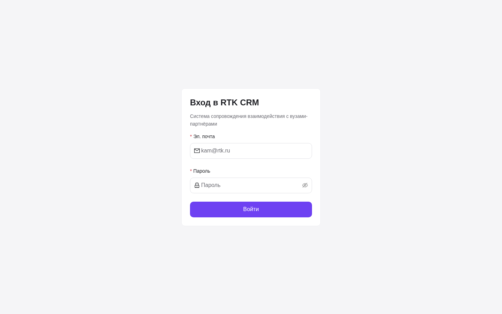
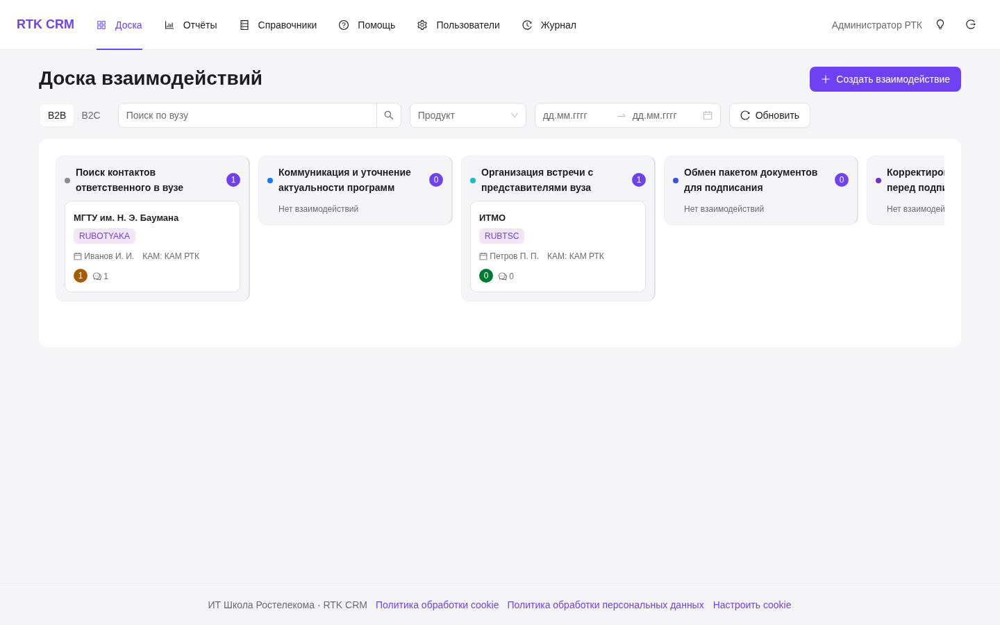
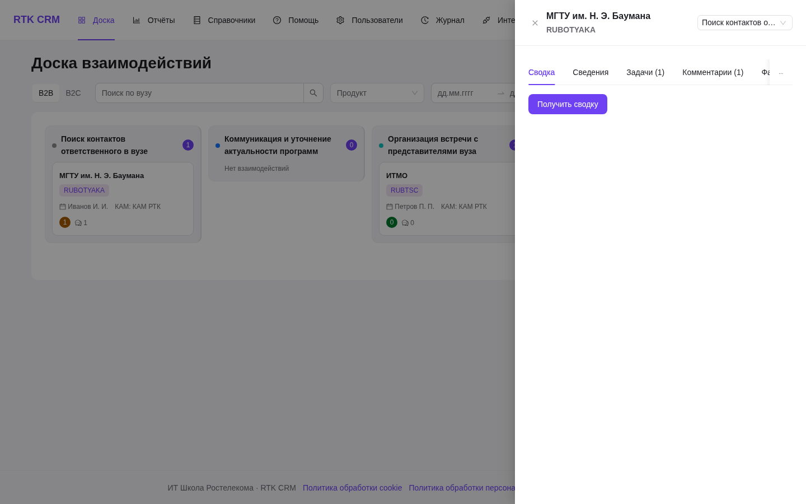
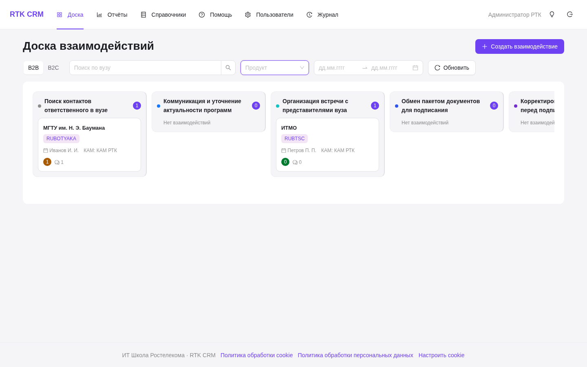
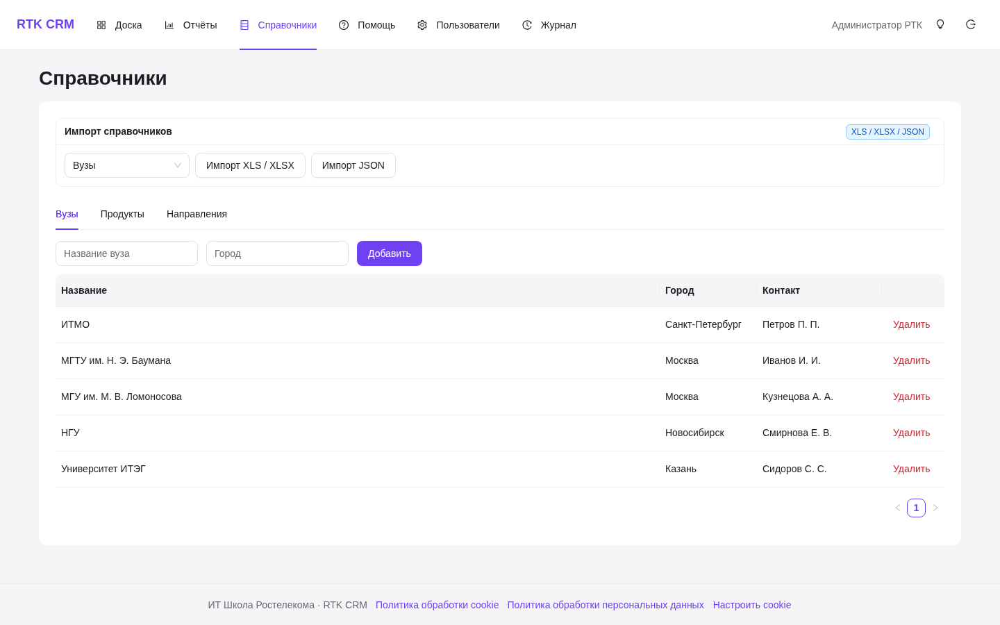
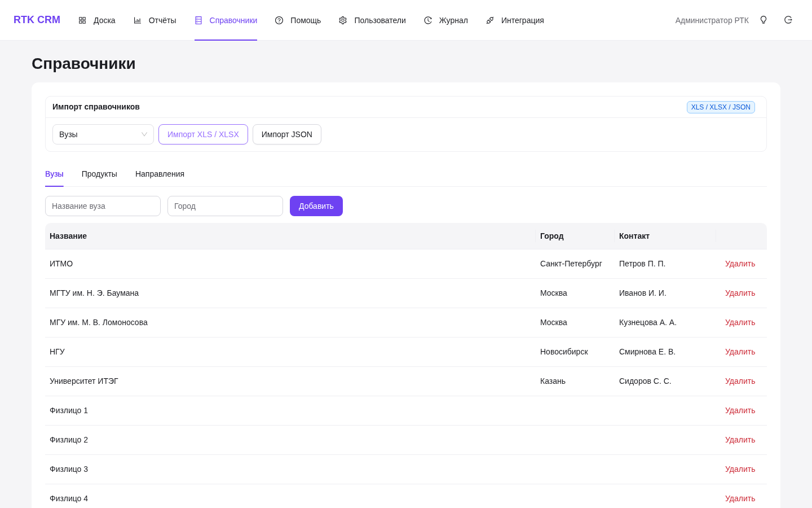
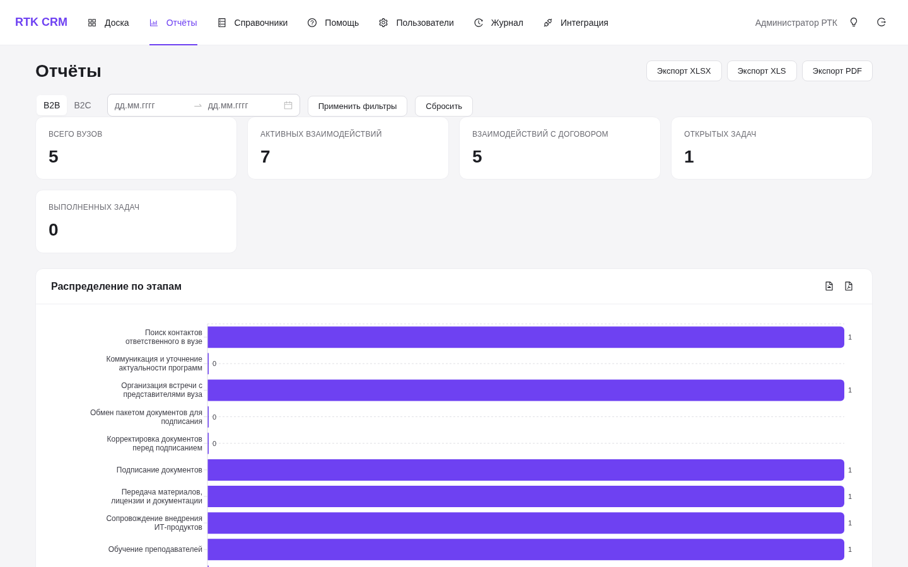
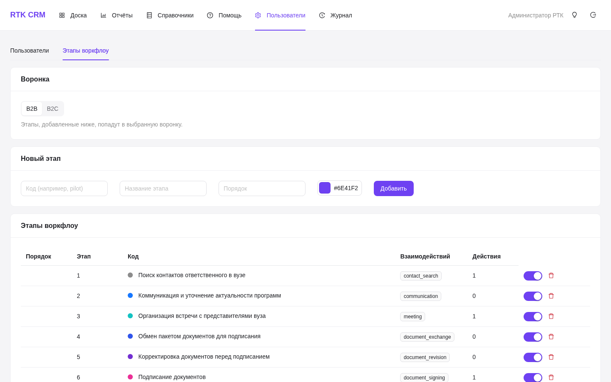
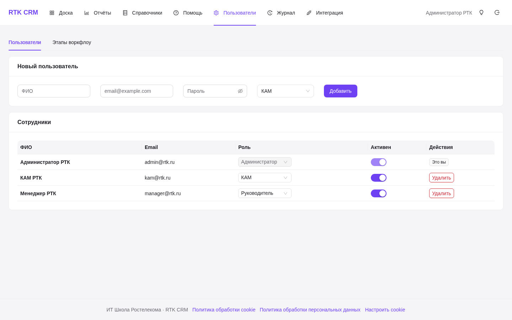
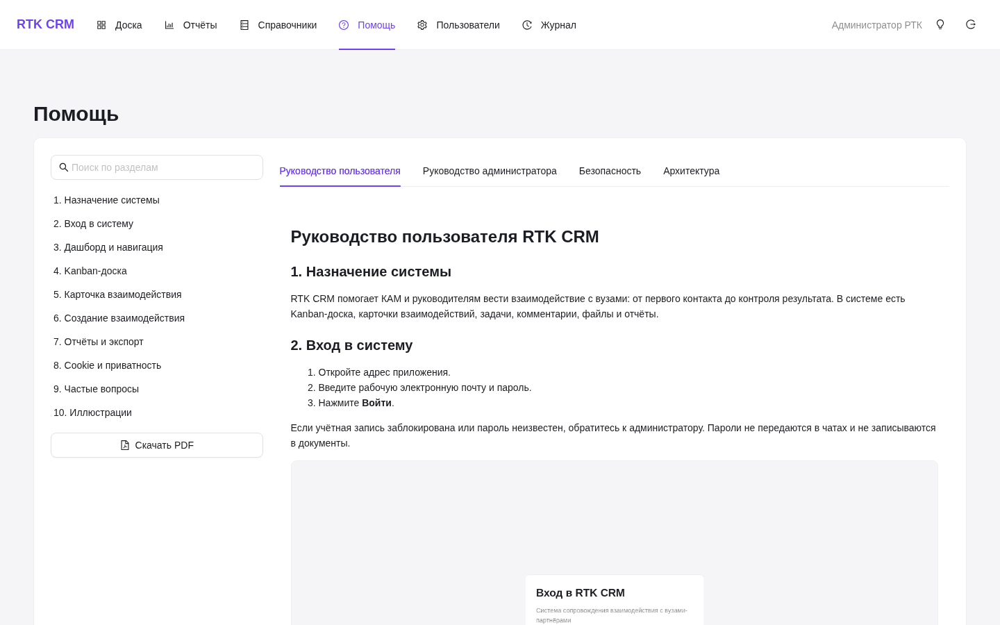

# Система контроля взаимодействия ИТ Школы Ростелекома с вузами

CRM для кейса «ИТ Школа» хакатона «Лидеры цифровой трансформации 2026».
Визуализирует многоэтапный процесс взаимодействия с вузами-партнёрами,
ведёт учёт договоров, задач и комментариев по каждому взаимодействию.

[](https://github.com/Pavel1778/rtk-crm/actions/workflows/ci.yml)

## Что реализовано

- **Kanban-доска** взаимодействий с перемещением карточек между этапами
  (`@dnd-kit`), поиском по вузу и фильтром по продукту.
- **Карточка взаимодействия**: сведения, договор, задачи со сроками,
  комментарии, смена этапа.
- **Справочники**: вузы, ИТ-продукты, ИТ-направления.
- **Настройка воркфлоу**: добавление этапов, переименование, цвет колонки,
  порядок, включение/выключение.
- **Отчёт**: ключевые показатели и распределение взаимодействий по этапам.
- **Роли**: менеджер и администратор (доступ к справочникам и настройкам —
  только у администратора).
- **Адаптив**: на мобильной доска показывается одна колонка с выбором этапа.

## Ограничение бизнес-модели

У одного вуза может быть **не более 2 активных** взаимодействий —
проверяется на backend при создании.

## Стек

| Слой | Технологии |
|---|---|
| Backend | Python 3.11, FastAPI, SQLAlchemy 2 (async), JWT + bcrypt |
| Frontend | React 18, TypeScript, Vite, Ant Design 5, Zustand, @dnd-kit |
| БД | PostgreSQL (Supabase) или SQLite для локальной разработки |
| Деплой | Render (backend), Vercel (frontend), Supabase (БД) |

## Бизнес-модель

```text
University  ──┐
              ├──► Interaction ──► WorkflowStage
ITProduct  ───┘         │
ITDirection ── ITProduct       ├── Action (задача со сроком)
                               └── Comment
```

`University`, `ITProduct`, `ITDirection` — справочники.
`Interaction` — главная сущность, связка «вуз + продукт», перемещается по этапам.

## Структура репозитория

```text
backend/          FastAPI-приложение (пакет backend)
  core/config.py    настройки из окружения
  db/               база и сессия
  models/           модели и перечисления
  schemas/          Pydantic-схемы
  api/              роутеры: auth, universities, directories,
                    stages, interactions, reports
  seed.py           справочники + демо-данные
  start.sh          старт на Render
frontend/         React-приложение (Vite)
  src/api/          axios-клиент и описание эндпоинтов
  src/pages/        BoardPage, ReportPage, DirectoryPage,
                    SettingsPage, LoginPage
  src/components/   MainLayout, kanban, interaction
docs/             DEPLOYMENT.md, STACK.md, USER_GUIDE.md,
                  architecture/, security/, pitch.md
```

## Локальный запуск

### Backend

```powershell
python -m venv .venv
.venv\Scripts\Activate.ps1
pip install -r backend\requirements.txt
# создать .env в корне репозитория:
# DATABASE_URL=sqlite+aiosqlite:///./dev.db
python scripts\run_dev.py
```

`Settings` читает `.env` из текущего каталога, поэтому файл кладётся в корень
репозитория (рядом с `README.md`), а не в `backend/`.

Запускать нужно через `scripts/run_dev.py`: приложение живёт как пакет `app`
(в контейнере — `/app`, в репозитории — `backend/`), поэтому
`uvicorn backend.main:app` из корня падает с `ModuleNotFoundError: app`.
Скрипт делает пакет импортируемым и поднимает uvicorn с автоперезагрузкой.

Swagger: http://127.0.0.1:8000/docs

### Frontend

```powershell
cd frontend
npm install
npm run dev
```

http://127.0.0.1:5173 — dev-сервер проксирует `/api` на `localhost:8000`,
поэтому `VITE_API_URL` в разработке не нужен.

### Демо-доступ

| Роль | Email | Пароль |
|---|---|---|
| Администратор | `admin@rtk.ru` | `admin123` |
| Менеджер | `manager@rtk.ru` | `manager123` |

## Деплой

Пошаговая инструкция для Render + Supabase + Vercel:
[docs/DEPLOYMENT.md](docs/DEPLOYMENT.md).

## Документация

- [DEPLOYMENT.md](docs/DEPLOYMENT.md) — развёртывание
- [ARCHITECTURE.md](docs/architecture/ARCHITECTURE.md) — архитектура
- [USER_GUIDE.md](docs/USER_GUIDE.md) — руководство пользователя
- [ADMIN_GUIDE.md](docs/ADMIN_GUIDE.md) — руководство администратора
- [SECURITY.md](docs/SECURITY.md) — безопасность, 152-ФЗ и privacy
- [pitch.md](docs/pitch.md) — презентационный сценарий
- [qa-jury.md](docs/qa-jury.md) — вопросы жюри и ответы

## Интерфейс

Скриншоты актуальной сборки лежат в [docs/images](docs/images).

### Вход в систему



### Доска взаимодействий (Kanban)



### Карточка вуза



### Фильтры на доске



### Справочники



### Импорт XLSX и сопоставление полей



### Отчёты с экспортом диаграмм в PNG/PDF



### Конструктор воркфлоу



### Настройки



### Встроенная документация `/help`



## Production

- Frontend: https://rtk-crm-nx4r.vercel.app
- Backend: https://rtk-crm-backend.onrender.com

## Нагрузочная проверка

```bash
locust -f tests/load/locustfile.py RTKUser \
  --headless -u 50 -r 5 -t 60s \
  --host=http://localhost:8000 \
  --html=tests/load/report.html
```

Для отдельной проверки десяти параллельных отчётов используйте сценарий
`ReportsUser`; подробности находятся в
[tests/load/README.md](tests/load/README.md).
