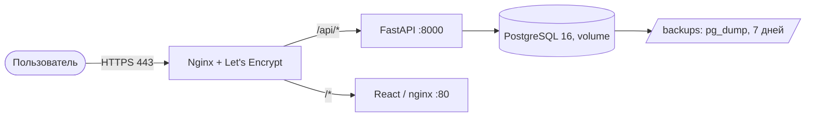

# 🏗 Архитектура RTK CRM

## Обзор системы

RTK CRM — это B2B CRM-система для менеджеров Ростелекома, управляющих взаимодействием с вузами. Система реализует полный цикл из 14 этапов воркфлоу.

## Диаграмма компонентов

```
┌─────────────────────────────────────────────────────────────┐
│                        Client Layer                         │
│  ┌─────────────┐  ┌─────────────┐  ┌─────────────┐         │
│  │   Browser   │  │   Mobile    │  │   Admin     │         │
│  │   (React)   │  │   App       │  │   Panel     │         │
│  └──────┬──────┘  └──────┬──────┘  └──────┬──────┘         │
└─────────┼────────────────┼────────────────┼────────────────┘
          │                │                │
          └────────────────┼────────────────┘
                           │ HTTPS (443)
                    ┌──────▼──────┐
                    │   Nginx     │  ← Reverse Proxy, SSL, Static
                    └──────┬──────┘
                           │
          ┌────────────────┼────────────────┐
          │                │                │
   ┌──────▼──────┐  ┌──────▼──────┐  ┌──────▼──────┐
   │  Frontend   │  │   Backend   │  │   Keycloak  │
   │  (Port 3000)│  │  (Port 8000)│  │  (Port 8080)│
   │   React     │  │   FastAPI   │  │   OAuth2    │
   └─────────────┘  └──────┬──────┘  └─────────────┘
                           │
                ┌──────────┼──────────┐
                │          │          │
         ┌──────▼───┐  ┌──▼────┐  ┌──▼──────┐
         │ Postgres │  │ Redis │  │  Files  │
         │  (5432)  │  │(6379) │  │ Storage │
         └──────────┘  └───────┘  └─────────┘
```

## Технологический стек

### Backend
- **Язык**: Python 3.11
- **Фреймворк**: FastAPI 0.104
- **ORM**: SQLAlchemy 2.0 (AsyncIO)
- **Валидация**: Pydantic v2
- **Миграции**: Alembic
- **Аутентификация**: python-jose, passlib

### Frontend
- **Фреймворк**: React 18
- **Язык**: TypeScript 5.x
- **Сборка**: Vite
- **UI Kit**: Ant Design
- **HTTP клиент**: Axios

### Базы данных
- **Основная**: PostgreSQL 16 (ACID, JSONB, Full-text search)
- **Кэш**: Redis 7 (Sessions, Cache, Queue)

### Инфраструктура
- **Контейнеризация**: Docker, Docker Compose
- **Web Server**: Nginx (Alpine)
- **Auth Server**: Keycloak 24.0

## Модульная архитектура Backend

```
backend/
├── app/
│   ├── main.py              # Точка входа, middleware
│   ├── database.py          # DB подключение, сессии
│   ├── config.py            # Настройки (pydantic-settings)
│   │
│   ├── models/              # SQLAlchemy модели
│   │   ├── __init__.py
│   │   ├── university.py    # Вузы
│   │   ├── workflow.py      # Этапы воркфлоу
│   │   ├── user.py          # Пользователи, роли
│   │   ├── file.py          # Прикрепленные файлы
│   │   ├── log.py           # Action Log (152-ФЗ)
│   │   └── comment.py       # Комментарии
│   │
│   ├── schemas/             # Pydantic схемы (DTO)
│   │   ├── __init__.py
│   │   ├── university.py
│   │   ├── workflow.py
│   │   ├── user.py
│   │   └── auth.py
│   │
│   ├── api/                 # API роутеры (REST)
│   │   ├── __init__.py
│   │   ├── universities.py  # CRUD вузов
│   │   ├── workflow.py      # Управление этапами
│   │   ├── reports.py       # Генерация отчетов
│   │   ├── files.py         # Загрузка файлов
│   │   └── auth.py          # Логин, JWT
│   │
│   └── services/            # Бизнес-логика
│       ├── __init__.py
│       ├── reports.py       # PDF/XLSX генерация
│       ├── audit_logger.py  # Логирование (ФСТЭК)
│       └── workflow_service.py
│
├── alembic/                 # Миграции БД
├── seed.py                  # Тестовые данные
└── requirements.txt
```

## Схема базы данных

### Основные таблицы

1. **universities** — Вузы и контракты
   - `id`, `name`, `vendor`, `product`
   - `contract_number`, `license_signed`, `license_expiry_year`
   - `status`, `manager_name`, `university_responsible`
   - `current_workflow_stage_id` (FK → workflow_stages)

2. **workflow_stages** — 14 этапов воркфлоу
   - `id`, `name`, `order` (1-14), `description`
   - `is_active`

3. **users** — Пользователи системы
   - `id`, `username`, `email`, `hashed_password`
   - `role` (enum: user, manager, admin)
   - `is_active`, `last_login`

4. **attached_files** — Файлы
   - `id`, `university_id` (FK)
   - `file_name`, `file_path`, `mime_type`, `file_size`
   - `uploaded_by`

5. **action_logs** — Журнал действий (152-ФЗ)
   - `id`, `university_id` (FK)
   - `action`, `description`, `user`, `ip_address`
   - `old_value`, `new_value` (JSON)
   - `created_at` (индекс для аудита)

6. **comments** — Комментарии
   - `id`, `university_id` (FK)
   - `text`, `author`, `created_at`

## Безопасность и 152-ФЗ

### RBAC (Role-Based Access Control)

| Роль | Права |
|------|-------|
| **User** | Чтение вузов, комментарии |
| **Manager** | CRUD вузов, загрузка файлов, перемещение по воркфлоу |
| **Admin** | Полный доступ, управление пользователями, логи |

### Логирование (ФСТЭК)

Все действия записываются в `action_logs`:
- Кто (user, ip_address)
- Что сделал (action, old_value, new_value)
- Когда (created_at)
- С чем (university_id)

### Аутентификация

- Keycloak (OAuth2 / OpenID Connect)
- JWT токены (access + refresh)
- HTTPS обязательный

## API Endpoints

### Universities
- `GET /api/v1/universities/` — список вузов (фильтрация, пагинация)
- `GET /api/v1/universities/{id}` — детали вуза
- `POST /api/v1/universities/` — создать вуз
- `PUT /api/v1/universities/{id}` — обновить вуз
- `DELETE /api/v1/universities/{id}` — удалить вуз

### Workflow
- `GET /api/v1/workflow/stages/` — список этапов
- `PUT /api/v1/universities/{id}/stage` — переместить на этап

### Reports
- `GET /api/v1/reports/pdf?status=...` — PDF отчет
- `GET /api/v1/reports/xlsx?manager=...` — XLSX отчет

### Files
- `POST /api/v1/files/upload/` — загрузить файл
- `GET /api/v1/files/{id}/` — скачать файл
- `DELETE /api/v1/files/{id}/` — удалить файл

### Auth
- `POST /api/v1/auth/login/` — получить JWT
- `POST /api/v1/auth/refresh/` — обновить JWT
- `POST /api/v1/auth/logout/` — logout

## Масштабируемость

### Горизонтальное масштабирование
- Backend: несколько инстансов через Docker Swarm / Kubernetes
- Database: репликация PostgreSQL (master-slave)
- Cache: Redis Cluster

### Оптимизация
- Индексы на часто используемых полях (status, manager_name, created_at)
- Кеширование запросов в Redis
- Асинхронные операции (asyncpg, aiofiles)

## Мониторинг и логирование

- Health checks: `/health` endpoint
- Логи: stdout/stderr (Docker logs)
- Метрики: Prometheus exporter (опционально)

## Развертывание

### Production чеклист

- [ ] Заменить SECRET_KEY на случайную строку
- [ ] Настроить HTTPS сертификаты
- [ ] Включить backup PostgreSQL
- [ ] Настроить мониторинг
- [ ] Ограничить доступ к админке
- [ ] Включить rate limiting

## Контакты

Команда разработки: team@rtk-crm.ru  
Хакатон: "Лидеры цифровой трансформации 2026"  
Кейс №6: ИТ Школа Ростелекома

## План миграции в Yandex Cloud

### Обоснование

Сейчас контур размещён за пределами РФ: Render (backend), Vercel (frontend),
Supabase (PostgreSQL, регион us-west-2). Требования 152-ФЗ «О персональных
данных» к локализации баз данных граждан РФ и приказ ФСТЭК России № 117
предполагают размещение в российском контуре. Yandex Cloud даёт аттестованную
инфраструктуру и переносится без изменения кода — весь стек уже контейнеризован.

### Целевая схема



Всё выполняется на одной ВМ Ubuntu 22.04 (2 vCPU, 4 ГБ RAM, 20 ГБ SSD).

### Пошаговый план

1. Создать ВМ и статический публичный IP.
2. Выполнить `infra/yandex-cloud/setup-vm.sh` (Docker, certbot, ufw, cron-бэкап).
3. Заполнить `.env` по шаблону `infra/yandex-cloud/.env.prod.example`.
4. Направить A-запись домена на IP, выпустить сертификат Let's Encrypt.
5. Поднять стек: `docker compose -f infra/yandex-cloud/docker-compose.prod.yml --env-file .env up -d --build`.
6. Перенести данные из Supabase: `pg_dump` → `pg_restore` в контейнер `rtk_postgres`.
7. Проверить `https://<домен>/api/health`, затем переключить DNS с Vercel.

Подробности и команды — в `infra/yandex-cloud/README.md`.

### Что переносится автоматически, а что вручную

| Автоматически (`docker compose`) | Вручную |
|---|---|
| Сборка и запуск backend, frontend, nginx | Создание ВМ и статического IP |
| Схема БД (создаётся приложением при старте) | Перенос данных (`pg_dump` / `pg_restore`) |
| Ежедневные бэкапы (cron + `backup.sh`) | A-запись домена и выпуск сертификата |
| Переменные окружения из `.env` | Заполнение секретов в `.env` |

### Смета

ВМ 2 vCPU / 4 ГБ (~800 ₽) + SSD 20 ГБ (~200 ₽) + статический IP (~150 ₽) +
трафик (~50 ₽) ≈ **1 200 ₽ в месяц**. Стартовый грант 4 000 ₽ покрывает более
трёх месяцев работы.

### Обратная совместимость

Текущий деплой не ломается: базовый `docker-compose.yml` не изменялся,
Yandex-вариант вынесен в отдельные файлы (`docker-compose.prod.yml` в корне —
оверлей с локальным Postgres, `infra/yandex-cloud/docker-compose.prod.yml` —
полный прод-стек с nginx и TLS).
