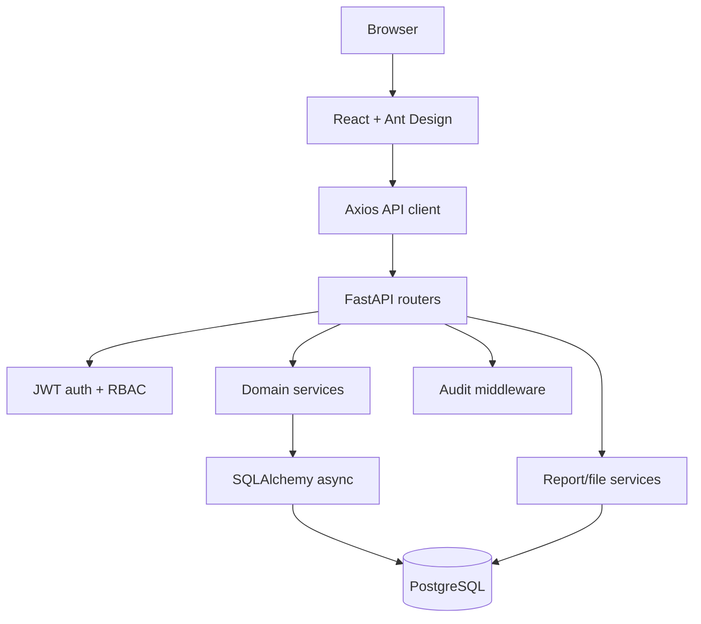

# C4 Components

```mermaid
flowchart TB
    browser[Browser]
    app[React + Ant Design]
    client[Axios API client]
    api[FastAPI routers]
    auth[JWT auth + RBAC]
    domain[Domain services]
    audit[Audit middleware]
    orm[SQLAlchemy async]
    postgres[(PostgreSQL)]
    files[Report/file services]

    browser --> app --> client --> api
    api --> auth
    api --> domain
    api --> audit
    domain --> orm --> postgres
    api --> files
    files --> postgres
```

Frontend отвечает за представление и интеракции, backend — за авторизацию,
валидацию, бизнес-правила, аудит и доступ к данным.
