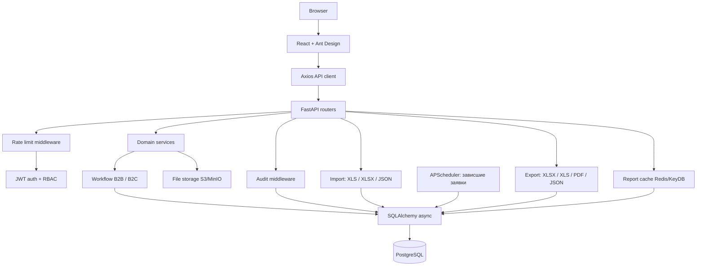

# C4 Components

Frontend отвечает за представление и интеракции, backend — за авторизацию,
валидацию, бизнес-правила, аудит и доступ к данным. Кэш агрегатов отчётов
и планировщик уведомлений вынесены в отдельные сервисы, чтобы не блокировать
обработку запросов.
