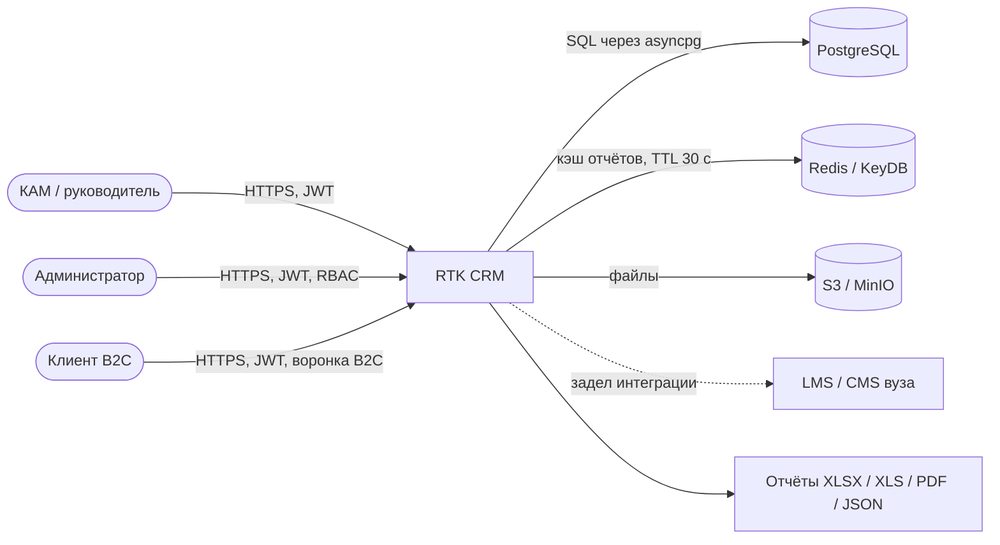

# C4 Context

Система принимает действия пользователей, ведёт два независимых workflow
(B2B — 14 этапов ИТ-Школы, B2C — упрощённая воронка), хранит рабочие данные
в PostgreSQL, кэширует агрегаты отчётов и формирует выгрузки в четырёх
форматах.
