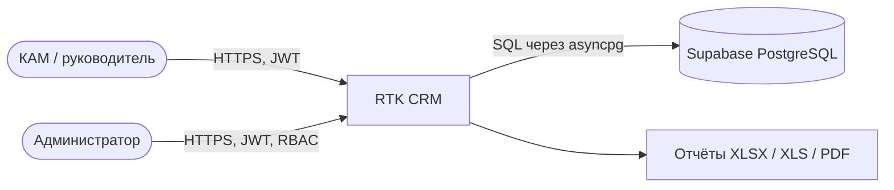

# C4 Context

```mermaid
flowchart LR
    kam([КАМ / руководитель])
    admin([Администратор])
    crm[RTK CRM]
    db[(Supabase PostgreSQL)]
    export[Отчёты XLSX / XLS / PDF]

    kam -->|HTTPS, JWT| crm
    admin -->|HTTPS, JWT, RBAC| crm
    crm -->|SQL через asyncpg| db
    crm --> export
```

Система принимает действия пользователей, хранит рабочие данные в PostgreSQL
и формирует отчёты через backend.
