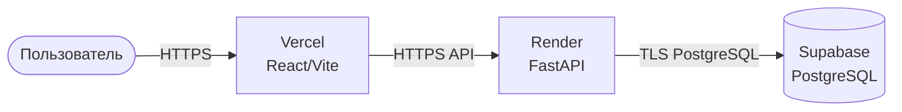

# Текущее развёртывание

```mermaid
flowchart LR
    user([Пользователь]) -->|HTTPS| vercel[Vercel\nReact/Vite]
    vercel -->|HTTPS API| render[Render\nFastAPI]
    render -->|TLS PostgreSQL| supabase[(Supabase\nPostgreSQL)]
```

Vercel публикует статический frontend. Render обслуживает API. Supabase
предоставляет PostgreSQL. CORS backend ограничивает разрешённые origins.
