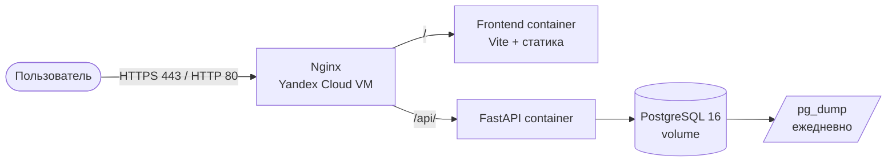

# Развёртывание в Yandex Cloud

## Схема

Все контейнеры — в одной docker-сети. Наружу открыт только nginx: backend
и база снаружи недоступны.

## Компоненты

| Компонент | Реализация | Где описано |
|---|---|---|
| ВМ | Ubuntu 22.04/24.04, 2 vCPU, 4 ГБ RAM | `infra/yandex-cloud/README.md` |
| nginx | `nginx:1.27-alpine`, шаблоны конфига | `infra/yandex-cloud/nginx-*.conf.template` |
| Backend | FastAPI + uvicorn в контейнере | `backend/Dockerfile` |
| Frontend | сборка Vite, отдаётся nginx | `frontend/Dockerfile` |
| БД | PostgreSQL 16 в контейнере | `docker-compose.prod.yml` |
| TLS | Let's Encrypt через certbot | `infra/yandex-cloud/README.md` |

## Два режима работы

Режим задаётся `TLS_ENABLED` в `.env`, шаблон nginx выбирается при старте
контейнера (`nginx-entrypoint.sh`):

- `TLS_ENABLED=false` — только 80-й порт, ответ по IP. Нужен для отладки,
  когда домена и сертификата ещё нет: с TLS nginx не стартует без
  `/etc/letsencrypt/live/$DOMAIN/fullchain.pem`.
- `TLS_ENABLED=true` — 80 (редирект на HTTPS) и 443 с сертификатом.

## Один origin вместо двух

В предыдущем контуре фронтенд (Vercel) и backend (Render) жили на разных
доменах, поэтому каждый запрос был cross-origin и требовал корректного
CORS-allowlist. После переезда и фронтенд, и API отдаёт один nginx:
запросы идут на тот же origin, путь `/api/` проксируется на backend.
`VITE_API_URL` при сборке остаётся пустым — если задать абсолютный адрес,
браузер пойдёт в backend мимо nginx и получит CORS-отказ.

## Размещение данных и 152-ФЗ

ВМ в Yandex Cloud находится в российском контуре, что соответствует
требованиям 152-ФЗ к хранению персональных данных. Демонстрационные данные
обезличены (`SEED_DEMO_DATA=true`).

## Что нужно для переноса

1. Создать ВМ со статическим публичным IP.
2. Запустить `setup-vm.sh` (Docker, swap, ufw, клонирование репозитория).
3. Заполнить `.env` по `infra/yandex-cloud/.env.prod.example`.
4. Поднять стек в режиме `TLS_ENABLED=false` и проверить `/api/health`.
5. Для домена: A-записи на IP ВМ, `certbot certonly --standalone`,
   затем `TLS_ENABLED=true`.
6. Перенести данные: `pg_dump` → `pg_restore` в контейнер `rtk_postgres`.
7. Переключить DNS.
