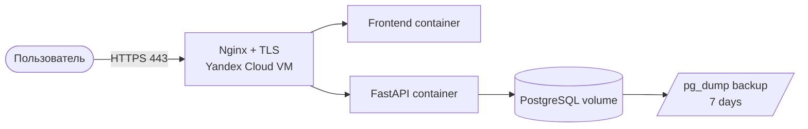

# Целевое развёртывание в Yandex Cloud

Целевой вариант описан в `infra/yandex-cloud/`. Перенос требует отдельного
решения владельца системы, миграции данных, выпуска сертификата и проверки
152-ФЗ в выбранном контуре.
