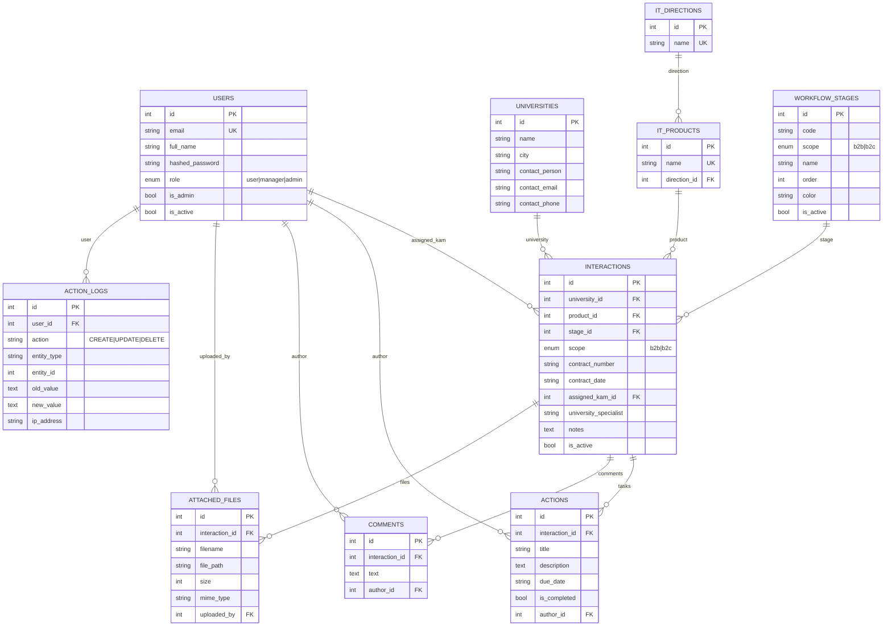

# Модель данных (ER)

ER-диаграмма по фактическим моделям SQLAlchemy
(`backend/models/entities.py`). Диаграмма экспортируется в PNG/PDF средствами
GitHub или Mermaid CLI; исходник версионируется вместе с кодом.

Готовые артефакты рядом: [`er.mmd`](er.mmd) — извлечённый Mermaid-исходник,
[`er-model.pdf`](er-model.pdf) — отрендеренная диаграмма,
[`er.archimate`](er.archimate) — та же схема в ArchiMate 3 для Archi.
Пересборка: `python scripts/extract_er_diagram.py`, затем
`mmdc -i er.mmd -o er-model.pdf`.

## Правила целостности

| Связь | On delete | Смысл |
|---|---|---|
| `interactions.university_id → universities.id` | `CASCADE` | Вуз с историей взаимодействий не удаляется в отрыве — история уходит вместе с ним |
| `interactions.product_id → it_products.id` | `SET NULL` | Удаление продукта не рушит карточку |
| `interactions.stage_id → workflow_stages.id` | `RESTRICT` | Активный этап нельзя удалить, пока на нём есть карточки — сначала перенос задач |
| `interactions.assigned_kam_id → users.id` | `SET NULL` | Увольнение сотрудника не удаляет заявки |
| `actions/ comments / attached_files .interaction_id` | `CASCADE` | Дочерние записи живут только внутри карточки |
| `*_logs.user_id → users.id` | `SET NULL` | Записи аудита сохраняются после удаления пользователя |

## Индексирование

Индексы заведены на внешние ключи и поля фильтрации (`interactions.university_id`,
`interactions.stage_id`, `action_logs.user_id`) и на часто фильтруемые
строки (`universities.name`). Это обеспечивает приемлемую скорость при
фильтрации доски и построении отчётов на целевой нагрузке 300+.

## Workflow B2B и B2C

Два набора этапов различаются значением `workflow_stages.scope`:
`WORKFLOW_STAGES` (14 этапов ИТ-Школы) для B2B и `B2C_STAGES` (упрощённая
воронка «заявка → оплата → обучение → завершено») для B2C. Версионирование
не применяется: изменение этапа действует на все активные заявки сразу.
