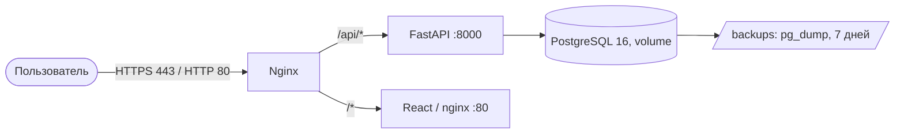

# 🏗 Архитектура RTK CRM

## Обзор системы

RTK CRM — это B2B CRM-система для менеджеров Ростелекома, управляющих взаимодействием с вузами. Система реализует полный цикл из 14 этапов воркфлоу.

## Диаграммы

- **C4 Level 1** — [System Context](/docs/architecture/c4-context.md)
- **C4 Level 2** — [Containers / Components](/docs/architecture/c4-components.md)
- **Функциональная архитектура** — [пользовательский путь и сервисы](/docs/architecture/functional.md)
- **Модель данных (ER)** — [сущности и связи](/docs/architecture/er-model.md)

### Модели в Archi (ArchiMate 3)

Требование ТЗ 6.7 — функциональная и компонентная архитектура в Archi.
Модели открываются в [Archi](https://www.archimatetool.com/) бесплатно.

- **Функциональная** — [`functional.archimate`](/docs/architecture/functional.archimate):
  пользовательский путь из 5 шагов (авторизация → просмотр → фильтрация →
  актуализация статуса → отчёт) и обслуживающие сервисы.
  [PDF-версия](/docs/architecture/functional.pdf).
- **Компонентная** — [`rtk-crm.archimate`](/docs/architecture/rtk-crm.archimate): контейнеры,
  внешние системы и целевое развёртывание.
- **Модель данных (ER)** — [`er.archimate`](/docs/architecture/er.archimate): 14 сущностей и
  правила `ON DELETE`. [PDF-версия](/docs/architecture/er-model.pdf).
- **Развёртывание** — [текущее](/docs/architecture/deployment-current.md) и [в Yandex Cloud](/docs/architecture/deployment-yandex-cloud.md)

Диаграммы написаны в Mermaid и рендерятся прямо в GitHub/GitLab, поэтому не
требуют отдельного экспорта в PDF для ревью. Версия для презентации
собирается из этих же исходников.

## Диаграмма компонентов

```
┌─────────────────────────────────────────────────────────────┐
│                        Client Layer                         │
│  ┌─────────────┐  ┌─────────────┐  ┌─────────────┐         │
│  │   Browser   │  │   Mobile    │  │   Admin     │         │
│  │   (React)   │  │   App       │  │   Panel     │         │
│  └──────┬──────┘  └──────┬──────┘  └──────┬──────┘         │
└─────────┼────────────────┼────────────────┼────────────────┘
          │                │                │
          └────────────────┼────────────────┘
                           │ HTTPS (443)
                    ┌──────▼──────┐
                    │   Nginx     │  ← Reverse Proxy, SSL, Static
                    └──────┬──────┘
                           │
          ┌────────────────┼────────────────┐
          │                │                │
   ┌──────▼──────┐  ┌──────▼──────┐  ┌──────▼──────┐
   │  Frontend   │  │   Backend   │  │   Keycloak  │
   │  (Port 3000)│  │  (Port 8000)│  │  (Port 8080)│
   │   React     │  │   FastAPI   │  │   OAuth2    │
   └─────────────┘  └──────┬──────┘  └─────────────┘
                           │
                ┌──────────┼──────────┐
                │          │          │
         ┌──────▼───┐  ┌──▼────┐  ┌──▼──────┐
         │ Postgres │  │ Redis │  │  Files  │
         │  (5432)  │  │(6379) │  │ Storage │
         └──────────┘  └───────┘  └─────────┘
```

## Технологический стек и обоснование выбора

Полные версии зависимостей — в [`../STACK.md`](/docs/STACK.md).

### Backend
- **Язык**: Python 3.11
- **Фреймворк**: FastAPI 0.141
- **ORM**: SQLAlchemy 2.0 (AsyncIO)
- **Валидация**: Pydantic v2
- **Миграции**: Alembic
- **Аутентификация**: python-jose, passlib

### Frontend
- **Фреймворк**: React 18
- **Язык**: TypeScript 5.x
- **Сборка**: Vite 7
- **UI Kit**: Ant Design
- **HTTP клиент**: Axios

### Базы данных
- **Основная**: PostgreSQL 16 (ACID, JSONB, Full-text search)
- **Кэш**: Redis 7 → KeyDB при росте нагрузки (см. раздел «Масштабируемость»)

### Инфраструктура
- **Контейнеризация**: Docker, Docker Compose
- **Web Server**: Nginx (Alpine) — целевой контур Yandex Cloud
- **Auth**: JWT (HS256) + bcrypt; Keycloak — вариант целевого контура

### Почему именно этот стек

| Компонент | Выбор | Почему не альтернатива |
|---|---|---|
| Backend | Python + FastAPI | ТЗ само предлагает Python/Postgres; FastAPI даёт асинхронный I/O под нагрузку 300+, автогенерацию OpenAPI и общий язык типов с Pydantic. Kotlin/Node потребовали бы отдельной команды и переписывания без выигрыша по задачам CRM |
| Frontend | React + Ant Design | Ant Design закрывает Kanban, таблицы, формы и фильтры «из коробки» — на прототипе это экономит недели вёрстки; React выбран из-за экосистемы dnd-kit (drag-and-drop этапов) и Recharts (графики отчётов) |
| БД | PostgreSQL | Реляционная модель с транзакциями подходит для workflow и аудита (152-ФЗ); SQLite используется только в тестах и локальном запуске |
| Кэш | Redis/KeyDB | Отчёты агрегируются по многим строкам; кэш на 30 с снимает нагрузку. KeyDB — многопоточный форк Redis с тем же протоколом, поэтому переход без изменений кода |
| Аутентификация | JWT сейчас, Keycloak как задел | Для прототипа JWT не требует отдельного сервиса; в коде оставлен путь к корпоративному Keycloak, если заказчик потребует SSO |

Единственное нестандартное решение — отказ от версионирования workflow
(прямое требование Q&A: «изменения применяются едино для всех»), поэтому в
модели нет таблицы версий, а перенос задач при удалении этапа встроен в
сервис.

## Модульная архитектура Backend

```
backend/
├── main.py                  # Точка входа, middleware, health-пробы
│
├── api/                     # REST-роутеры (префикс /api)
│   ├── auth.py              # Вход, пользователи
│   ├── interactions.py      # Карточки, доска, задачи, комментарии, сводка
│   ├── universities.py      # Вузы
│   ├── directories.py       # Направления и продукты
│   ├── catalogs.py          # Импорт XLS/XLSX/JSON
│   ├── stages.py            # Этапы воркфлоу, последствия удаления
│   ├── files.py             # Загрузка и выдача файлов
│   ├── reports.py           # Отчёты и экспорт
│   ├── audit.py             # Журнал действий (152-ФЗ)
│   ├── notifications.py     # Зависшие заявки
│   ├── integration.py       # Обмен с внешними системами
│   └── access.py            # Проверка доступа к взаимодействиям
│
├── auth/
│   ├── security.py          # JWT, пароли, get_current_user, RBAC
│   └── keycloak.py          # JWKS-валидация RS256 (AUTH_MODE=keycloak)
│
├── core/config.py           # Настройки (pydantic-settings)
├── db/                      # Подключение к БД, базовый класс, сессии
├── middleware/audit.py      # Автоматическая запись изменений в ActionLog
│
├── models/                  # SQLAlchemy-модели и перечисления
│   ├── entities.py          # University, Interaction, Action, Comment, User, ActionLog
│   └── enums.py             # Роли, scope B2B/B2C
│
├── schemas/entities.py      # Pydantic-схемы (DTO)
│
└── services/                # Бизнес-логика
    ├── excel_import.py      # Разбор XLS/XLSX/JSON
    ├── import_report.py     # Отчёт об импорте
    ├── excel_export.py      # Выгрузка отчётов
    ├── report_columns.py    # Набор колонок отчёта
    ├── report_cache.py      # Кэш отчётов (Redis/KeyDB)
    ├── file_storage.py      # S3/MinIO с локальным fallback
    ├── notifications.py     # Поиск зависших заявок
    ├── scheduler.py         # Периодические задачи
    ├── integration.py       # Внешние системы (LMS)
    ├── guide_pdf.py         # PDF-руководства
    └── gigachat.py          # Сводка по карточке (ФТ-6)
```

## Схема базы данных

Полная ER-диаграмма с полями, связями и правилами целостности —
в [`er-model.md`](/docs/architecture/er-model.md). Кратко:

| Таблица | Назначение |
|---|---|
| `users` | Пользователи и роли (user / manager / admin) |
| `universities` | Вузы и контактные лица |
| `it_directions`, `it_products` | Справочники направлений и продуктов |
| `workflow_stages` | Этапы воронки, разделены полем `scope` (b2b / b2c) |
| `interactions` | Карточки взаимодействий: вуз + продукт + этап + договор |
| `actions`, `comments`, `attached_files` | Задачи, комментарии и файлы карточки |
| `action_logs` | Журнал действий для аудита (152-ФЗ) |

Ключевое отличие от ранних версий: этап и договор относятся к
**взаимодействию** (`interactions`), а не к вузу напрямую — один вуз может
вести несколько параллельных взаимодействий (не более двух активных, как
требует Q&A).

## Безопасность и 152-ФЗ

### RBAC (Role-Based Access Control)

| Роль | Права |
|------|-------|
| **User** | Чтение вузов, комментарии |
| **Manager** | CRUD вузов, загрузка файлов, перемещение по воркфлоу |
| **Admin** | Полный доступ, управление пользователями, логи |

### Логирование (ФСТЭК)

Все действия записываются в `action_logs`:
- Кто (user, ip_address)
- Что сделал (action, old_value, new_value)
- Когда (created_at)
- С чем (university_id)

### Аутентификация

Два режима, переключаются `AUTH_MODE`:

- **`jwt`** (по умолчанию) — JWT Bearer-токены (HS256), пароли — bcrypt.
  Роли `user` / `manager` / `admin`, проверяются локально.
- **`keycloak`** — токены подписывает Keycloak (RS256), CRM проверяет
  подпись по публичным ключам realm (JWKS), затем `iss`, `aud` и срок
  действия. Роли берутся из `realm_access.roles` и синхронизируются с
  локальной учётной записью при входе. Устройство и порядок настройки —
  `docs/KEYCLOAK.md`.

HTTPS обязателен в обоих режимах. Сводка по карточке передаёт данные во
внешний сервис GigaChat только после проверки доступа (см. `docs/AI.md`).

### ИИ в workflow

ТЗ допускает применение ИИ внутри workflow (ФТ-6). В системе это одна
функция — сводка по карточке взаимодействия: КАМ открывает карточку и
получает короткий текст о текущем этапе, сделанном и следующем шаге.

| Аспект | Решение |
| --- | --- |
| Модель | GigaChat, закрытый контур Сбера |
| Данные в промпте | Только названия (вуз, продукт, этап), тексты комментариев и служебные поля |
| Персональные данные | Не передаются: в карточке не хранятся, отбрасываются на импорте |
| Соответствие | 152-ФЗ: обработка идёт в РФ, данные не покидают контур |
| Транспорт | HTTPS, проверка по корневому сертификату НУЦ Минцифры |
| Сбой сервиса | Не ломает карточку: 502 при выключенном демо-режиме, детерминированная сводка из данных карточки при включённом |

Демо-сводка помечается отдельной моделью `демо-сводка (GigaChat не
вызывался)`, поэтому её нельзя принять за ответ модели. Устройство и
настройка — `docs/AI.md`, требования безопасности — `docs/SECURITY.md`.

## API Endpoints

Полная схема — в Swagger UI (`/docs`). Ниже — маршруты, которые приложение
регистрирует фактически; префикс `/api` у всех, кроме служебных проб.

### Аутентификация и пользователи
- `POST /api/auth/login` — вход, выдача JWT
- `GET /api/auth/me` — текущий пользователь
- `GET|POST /api/auth/users` — список и создание пользователей
- `PATCH|DELETE /api/auth/users/{user_id}` — изменение и удаление

### Взаимодействия
- `GET|POST /api/interactions` — список с фильтрами и создание
- `GET /api/interactions/board` — данные Kanban-доски
- `GET|PATCH|DELETE /api/interactions/{interaction_id}` — карточка
- `POST /api/interactions/{interaction_id}/move` — смена этапа
- `GET|POST /api/interactions/{interaction_id}/actions` — задачи
- `PATCH|DELETE /api/interactions/actions/{action_id}`
- `GET|POST /api/interactions/{interaction_id}/comments` — комментарии
- `DELETE /api/interactions/comments/{comment_id}`
- `POST /api/interactions/{interaction_id}/summary` — сводка GigaChat (ФТ-6)

### Справочники и импорт
- `GET|POST /api/universities`, `GET|PATCH|DELETE /api/universities/{university_id}`
- `GET|POST /api/directions`, `DELETE /api/directions/{direction_id}`
- `GET|POST /api/products`, `DELETE /api/products/{product_id}`
- `POST /api/catalogs/import/preview` и `/execute` — импорт XLS/XLSX
- `POST /api/catalogs/import/json/preview` и `/execute` — импорт JSON
- `POST /api/catalogs/import/report` — отчёт об импорте

### Этапы воркфлоу
- `GET|POST /api/stages`, `POST /api/stages/reorder`
- `PATCH|DELETE /api/stages/{stage_id}`
- `GET /api/stages/{stage_id}/impact` — последствия удаления этапа

### Файлы
- `GET /api/files/interactions/{interaction_id}` — файлы карточки
- `POST /api/files/interactions/{interaction_id}/upload`
- `GET /api/files/{file_id}/download`, `DELETE /api/files/{file_id}`

### Отчёты и аудит
- `GET /api/reports`, `/columns`, `/preview`, `/universities`
- `GET /api/reports/xlsx`, `/xls`, `/pdf`, `/json`
- `GET /api/audit`, `/entity-types`, `/export`

### Уведомления и интеграция
- `GET /api/notifications/stuck`, `POST /api/notifications/stuck/dispatch`
- `GET /api/integration/schema`, `POST /api/integration/preview` и `/import`
- `GET /api/integration/outbound`, `GET /api/integration/pull/{source}`

### Служебные
- `GET /healthz` — liveness, `GET /readyz` — readiness (БД, кэш, S3)
- `GET /metrics` — метрики Prometheus

GigaChat в `/readyz` намеренно не проверяется: функция необязательная, и её
недоступность не должна переводить сервис в состояние degraded.

## Масштабируемость

Целевая нагрузка — **300+ одновременных пользователей** ИТ Школы: менеджеры
работают с доской и карточками весь день, администраторы параллельно грузят
справочники и смотрят отчёты. Ниже — за счёт чего система держит этот профиль
и что меняется при росте дальше.

### Что уже заложено в код

| Механизм | Где | Зачем при 300+ |
|---|---|---|
| Полностью асинхронный стек (FastAPI + SQLAlchemy AsyncIO + asyncpg) | `backend/main.py`, `backend/db/session.py` | I/O-ожидание БД не блокирует воркер: один процесс обслуживает сотни соединений |
| `NullPool` для подключений | `backend/db/session.py` | Совместимо с внешним пулером (pgbouncer Yandex Managed PostgreSQL, Supabase pooler): соединения не «залипают» в процессе |
| Кеш отчёта в Redis/KeyDB, TTL 30 с | `backend/services/report_cache.py` | Тяжёлые агрегаты не считаются на каждый запрос — снимает нагрузку с PostgreSQL |
| Rate limiting логина (5 попыток / 60 с на IP) | `backend/middleware/rate_limit.py` | Защита от перебора пароля и от всплеска 401 при сканировании |
| Индексы на внешних ключах и датах | `backend/alembic/versions/` | Фильтры доски и отчётов по этапу/дате не деградируют на росте данных |
| Фоновые задачи в одном инстансе (`max_instances=1`) | `backend/services/scheduler.py` | Проверка «зависших» заявок не размножается при нескольких репликах |

`/healthz` (liveness) и `/readyz` (readiness, проверяет БД) разделены
(`backend/main.py`): балансировщик уводит трафик с инстанса, потерявшего
БД, но не перезапускает его из-за кратковременного сбоя зависимости.

### Горизонтальное масштабирование

- **Backend**: несколько реплик за балансировщиком (Docker Swarm / Kubernetes).
  Приложение stateless: сессии — в JWT, кеш — в Redis/KeyDB, файлы — в S3/MinIO.
- **Кеш**: Redis заменяется на **KeyDB** — многопоточный форк с тем же
  протоколом и клиентом `redis-py`. Причина: Redis однопоточный, и на 300+
  пользователях один поток упирается в CPU раньше, чем в память. KeyDB
  использует все ядра без изменения кода — достаточно поменять образ
  в `docker-compose.yml`.
- **База**: PostgreSQL с репликой чтения для отчётов (master — запись,
  реплика — тяжёлые `SELECT` дашборда).
- **Файлы**: MinIO/S3 выносится за пределы пода backend, локальный диск
  используется только как fallback при разработке (`backend/services/file_storage.py`).

### Когда пора менять конфигурацию

| Симптом | Действие |
|---|---|
| CPU backend > 70 % | Добавить реплики бэкенда (горизонтально) |
| Кеш-хиты высокие, но latency растёт | Перейти на KeyDB, увеличить память кеша |
| Отчёты конкурируют с записью | Вынести чтение на реплику PostgreSQL |
| Рост числа фоновых уведомлений | Вынести scheduler в отдельный воркер |

### Оптимизация запросов

- Индексы на часто используемых полях (этап, продукт, дата создания, внешние ключи).
- Кеширование агрегатов отчёта (Redis/KeyDB, TTL 30 с), инвалидация при мутации.
- Асинхронные операции ввода-вывода (`asyncpg`, `aiofiles`).

## Мониторинг и логирование

- Health checks: `/healthz` (liveness), `/readyz` (readiness + БД),
  `/api/health` (расширенный статус), `/health` (короткий алиас для
  внешних платформ и health-check).
- Логи: stdout/stderr (Docker logs), структурированные через `loguru`.
- Метрики: `prometheus-fastapi-instrumentator` на `/metrics`.

## Развертывание

### Production чеклист

- [ ] Заменить SECRET_KEY на случайную строку
- [ ] Настроить HTTPS сертификаты
- [ ] Включить backup PostgreSQL
- [ ] Настроить мониторинг
- [ ] Ограничить доступ к админке
- [ ] Включить rate limiting

## Контакты

Команда разработки: RTK CRM, Ростов-на-Дону (познакомились во время обучения в РКСИ)
Почта: team@rtk-crm.ru  
Хакатон: "Лидеры цифровой трансформации 2026"  
Кейс №6: ИТ Школа Ростелекома

## План миграции в Yandex Cloud

### Обоснование

Сейчас контур размещён за пределами РФ: Render (backend), Vercel (frontend),
Supabase (PostgreSQL, регион us-west-2). Требования 152-ФЗ «О персональных
данных» к локализации баз данных граждан РФ и приказ ФСТЭК России № 117
предполагают размещение в российском контуре. Yandex Cloud даёт аттестованную
инфраструктуру и переносится без изменения кода — весь стек уже
контейнеризован. Внешний контур при этом остаётся рабочим и используется как
публичный демонстрационный стенд.

Инфраструктура для переезда подготовлена и проверена: собран и поднят весь
стек, вход через nginx отработал. Переключение прода выполняется сменой DNS
и требует решения владельца системы.

### Схема



Всё выполняется на одной ВМ Ubuntu 22.04/24.04 (2 vCPU, 4 ГБ RAM, 30 ГБ диска).

### Два режима nginx

Шаблон конфига выбирается при старте контейнера по `TLS_ENABLED`:

| `TLS_ENABLED` | Что поднимается | Назначение |
|---|---|---|
| `false` | только 80, ответ по IP | отладка, пока нет домена и сертификата |
| `true` | 80 (редирект) + 443 с сертификатом | демонстрация жюри |

Разделение нужно потому, что с TLS nginx не стартует без файлов
`/etc/letsencrypt/live/$DOMAIN/fullchain.pem` — без этого режима отладить
стек по IP было бы невозможно.

### Пошаговый план

1. Создать ВМ и статический публичный IP.
2. Выполнить `infra/yandex-cloud/setup-vm.sh` (Docker, certbot, ufw, swap,
   cron-бэкап, клонирование репозитория).
3. Заполнить `.env` по шаблону `infra/yandex-cloud/.env.prod.example`.
4. Поднять стек в режиме `TLS_ENABLED=false` и проверить `/api/health`.
5. Направить A-запись домена на IP, выпустить сертификат Let's Encrypt,
   переключить `TLS_ENABLED=true`.
6. Перенести данные из внешней БД: `pg_dump` → `pg_restore` в контейнер `rtk_postgres`.
7. Проверить `https://crm-rtk.pixel-minds.ru/api/health`, затем переключить DNS на IP ВМ.

Подробности и команды — в `infra/yandex-cloud/README.md`.

### Что переносится автоматически, а что вручную

| Автоматически (`docker compose`) | Вручную |
|---|---|
| Сборка и запуск backend, frontend, nginx | Создание ВМ и статического IP |
| Схема БД (создаётся приложением при старте) | Перенос данных (`pg_dump` / `pg_restore`) |
| Выбор конфига nginx по `TLS_ENABLED` | A-запись домена и выпуск сертификата |
| Ежедневные бэкапы (cron + `backup.sh`) | Заполнение секретов в `.env` |

### Смета

Вычислительные ресурсы 748,80 ₽ + RAM 4 ГБ 950,40 ₽ + диск 30 ГБ 103,68 ₽ +
публичный IP 189,73 ₽ = **1 992,61 ₽ в месяц**. Грант 5 000 ₽ покрывает
около 2,5 месяцев непрерывной работы.

### Обратная совместимость

Базовый `docker-compose.yml` не изменялся, Yandex-вариант вынесен в отдельные
файлы (`docker-compose.prod.yml` в корне — оверлей с локальным Postgres,
`infra/yandex-cloud/docker-compose.prod.yml` — полный прод-стек с nginx).
Локальный запуск через Vite-прокси тоже не затронут: `VITE_API_URL` по
умолчанию пуст, поэтому запросы идут на origin страницы.
