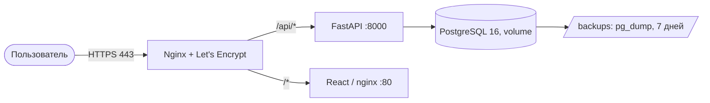

# Архитектура RTK CRM

## Обзор системы

RTK CRM — это веб-приложение для управления взаимодействиями с вузами-партнёрами, разработанное для хакатона ЛЦТ 2026.

## Технологический стек

### Backend

- **Язык:** Python 3.11
- **Фреймворк:** FastAPI
- **ORM:** SQLAlchemy (async)
- **База данных:** PostgreSQL (Supabase)
- **Аутентификация:** JWT (python-jose)
- **Хеширование паролей:** bcrypt (passlib)
- **Миграции:** Alembic
- **Асинхронный драйвер:** asyncpg

### Frontend

- **Язык:** TypeScript
- **Фреймворк:** React 18
- **Сборщик:** Vite
- **UI библиотека:** Ant Design
- **State management:** Zustand
- **HTTP клиент:** Axios
- **Графики:** Recharts
- **Drag-and-drop:** @dnd-kit

### Инфраструктура

- **Backend хостинг:** Render (Docker)
- **Frontend хостинг:** Vercel
- **База данных:** Supabase (PostgreSQL)
- **File storage:** Локальная файловая система

## Архитектура приложения

### Слоистая архитектура

```
┌─────────────────────────────────────┐
│         Frontend (React)            │
│  ┌───────────────────────────────┐  │
│  │  Components (Ant Design)     │  │
│  │  State (Zustand)             │  │
│  │  API Client (Axios)          │  │
│  └───────────────────────────────┘  │
└─────────────────────────────────────┘
                 │ HTTP/HTTPS
                 ▼
┌─────────────────────────────────────┐
│         Backend (FastAPI)           │
│  ┌───────────────────────────────┐  │
│  │  API Layer (routes)           │  │
│  │  Services (business logic)    │  │
│  │  Models (SQLAlchemy)          │  │
│  │  Schemas (Pydantic)           │  │
│  └───────────────────────────────┘  │
└─────────────────────────────────────┘
                 │ asyncpg
                 ▼
┌─────────────────────────────────────┐
│      Database (PostgreSQL)          │
│  ┌───────────────────────────────┐  │
│  │  Users                       │  │
│  │  Universities                 │  │
│  │  Interactions                │  │
│  │  Workflow Stages             │  │
│  │  Files                       │  │
│  │  Audit Log                   │  │
│  └───────────────────────────────┘  │
└─────────────────────────────────────┘
```

## Модель данных

### Основные сущности

#### User (Пользователь)
- id, email, full_name, hashed_password
- role (user/manager/admin)
- is_active, is_admin
- created_at, updated_at

#### University (Вуз)
- id, name, city, contact_person
- created_at, updated_at

#### ITDirection (ИТ-направление)
- id, name
- created_at, updated_at

#### ITProduct (ИТ-продукт)
- id, name, direction_id
- created_at, updated_at

#### WorkflowStage (Этап воркфлоу)
- id, code, name, order, color
- is_active
- created_at, updated_at

#### Interaction (Взаимодействие)
- id, university_id, product_id, stage_id
- assigned_kam_id, university_specialist
- contract_number, contract_date
- notes, is_active
- created_at, updated_at

#### Action (Задача)
- id, interaction_id, title, description
- due_date, is_completed
- created_at, updated_at

#### AttachedFile (Файл)
- id, interaction_id, filename
- file_path, mime_type, file_size
- created_at

#### ActionLog (Аудит)
- id, user_id, action, entity_type
- entity_id, ip_address
- created_at

## API Эндпоинты

### Аутентификация
- POST /api/auth/login — вход
- GET /api/auth/me — текущий пользователь
- GET /api/auth/users — список пользователей (admin)
- POST /api/auth/users — создание пользователя (admin)
- PATCH /api/auth/users/{id} — редактирование (admin)
- DELETE /api/auth/users/{id} — удаление (admin)

### Справочники
- GET /api/universities — список вузов
- POST /api/universities — создание (manager/admin)
- PATCH /api/universities/{id} — редактирование (manager/admin)
- DELETE /api/universities/{id} — удаление (manager/admin)

- GET /api/directions — список направлений
- POST /api/directions — создание (manager/admin)
- DELETE /api/directions/{id} — удаление (manager/admin)

- GET /api/products — список продуктов
- POST /api/products — создание (manager/admin)
- DELETE /api/products/{id} — удаление (manager/admin)

### Воркфлоу
- GET /api/stages — список этапов
- POST /api/stages — создание (admin)
- PATCH /api/stages/{id} — редактирование (admin)
- DELETE /api/stages/{id} — удаление (admin)

### Взаимодействия
- GET /api/interactions/board — канбан-доска
- GET /api/interactions — список взаимодействий
- POST /api/interactions — создание
- PATCH /api/interactions/{id} — редактирование
- DELETE /api/interactions/{id} — удаление
- POST /api/interactions/{id}/move — перемещение между этапами

### Файлы
- POST /api/files/interactions/{id}/upload — загрузка
- GET /api/files/{id}/download — скачивание
- DELETE /api/files/{id} — удаление

### Отчёты
- GET /api/reports — сводка
- GET /api/reports/xlsx — экспорт XLSX
- GET /api/reports/xls — экспорт XLS
- GET /api/reports/pdf — экспорт PDF
- GET /api/reports/json — экспорт JSON (LMS)

## Безопасность

### Аутентификация и авторизация

- JWT-токены с временем жизни 24 часа
- Ролевая модель доступа (RBAC)
- Проверка прав на каждом эндпоинте

### Аудит

- Middleware для записи всех mutating запросов
- Соответствие 152-ФЗ
- Хранение логов в базе данных

### Шифрование

- bcrypt для хеширования паролей
- HTTPS для передачи данных

## Развертывание

### Backend (Render)

- Dockerfile для контейнеризации
- Переменные окружения:
  - DATABASE_URL
  - SECRET_KEY
  - CORS_ORIGINS
  - SEED_DEMO_DATA

### Frontend (Vercel)

- Vite для сборки
- Переменные окружения:
  - VITE_API_URL

### Database (Supabase)

- PostgreSQL 15
- Connection pooling через pgbouncer
- Ежедневные бэкапы

## Производительность

### Кэширование

- React Query для кэширования API-запросов
- staleTime: 5 минут
- gcTime: 10 минут

### Оптимизация

- Асинхронные запросы к БД
- Индексы на frequently queried поля
- Lazy loading для больших списков

## Мониторинг

### Логи

- Uvicorn access logs
- Application logs через loguru
- Audit logs в базе данных

### Health checks

- GET /health — базовая проверка
- GET /api/health — проверка с БД
- GET /api/debug/cors — диагностика CORS

## Дальнейшее развитие

### Планируемые улучшения

- WebSocket для real-time обновлений
- Full-text поиск по взаимодействиям
- Advanced analytics и отчёты
- Mobile приложение (React Native)
- Интеграция с календарем
- Автоматические напоминания

## План миграции в Yandex Cloud

### Обоснование

Сейчас контур размещён за пределами РФ: Render (backend), Vercel (frontend),
Supabase (PostgreSQL, регион us-west-2). Требования 152-ФЗ «О персональных
данных» к локализации баз данных граждан РФ и приказ ФСТЭК России № 117
предполагают размещение в российском контуре. Yandex Cloud даёт аттестованную
инфраструктуру и переносится без изменения кода — весь стек уже контейнеризован.

### Целевая схема



Всё выполняется на одной ВМ Ubuntu 22.04 (2 vCPU, 4 ГБ RAM, 20 ГБ SSD).

### Пошаговый план

1. Создать ВМ и статический публичный IP.
2. Выполнить `infra/yandex-cloud/setup-vm.sh` (Docker, certbot, ufw, cron-бэкап).
3. Заполнить `.env` по шаблону `infra/yandex-cloud/.env.prod.example`.
4. Направить A-запись домена на IP, выпустить сертификат Let's Encrypt.
5. Поднять стек: `docker compose -f infra/yandex-cloud/docker-compose.prod.yml --env-file .env up -d --build`.
6. Перенести данные из Supabase: `pg_dump` → `pg_restore` в контейнер `rtk_postgres`.
7. Проверить `https://<домен>/api/health`, затем переключить DNS с Vercel.

Подробности и команды — в `infra/yandex-cloud/README.md`.

### Что переносится автоматически, а что вручную

| Автоматически (`docker compose`) | Вручную |
|---|---|
| Сборка и запуск backend, frontend, nginx | Создание ВМ и статического IP |
| Схема БД (создаётся приложением при старте) | Перенос данных (`pg_dump` / `pg_restore`) |
| Ежедневные бэкапы (cron + `backup.sh`) | A-запись домена и выпуск сертификата |
| Переменные окружения из `.env` | Заполнение секретов в `.env` |

### Смета

ВМ 2 vCPU / 4 ГБ (~800 ₽) + SSD 20 ГБ (~200 ₽) + статический IP (~150 ₽) +
трафик (~50 ₽) ≈ **1 200 ₽ в месяц**. Стартовый грант 4 000 ₽ покрывает более
трёх месяцев работы.

### Обратная совместимость

Текущий деплой не ломается: базовый `docker-compose.yml` не изменялся,
Yandex-вариант вынесен в отдельные файлы (`docker-compose.prod.yml` в корне —
оверлей с локальным Postgres, `infra/yandex-cloud/docker-compose.prod.yml` —
полный прод-стек с nginx и TLS).
