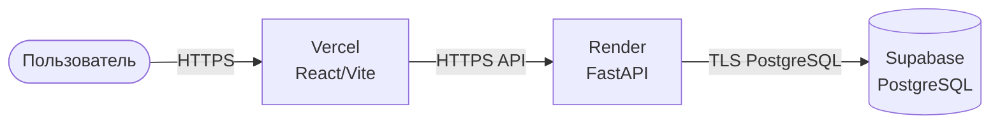

# Внешний контур (Render + Vercel + Supabase)

Vercel публикует статический frontend. Render обслуживает API. Supabase
предоставляет PostgreSQL. CORS backend ограничивает разрешённые origins.

Этот контур не требует своей инфраструктуры и используется как публичный
демонстрационный стенд. Основной контур — Yandex Cloud
(см. [deployment-yandex-cloud.md](/docs/architecture/deployment-yandex-cloud.md)).
