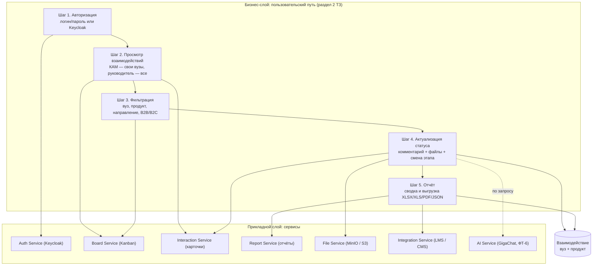
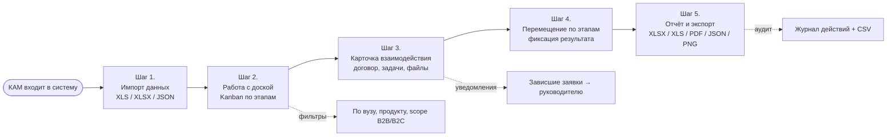
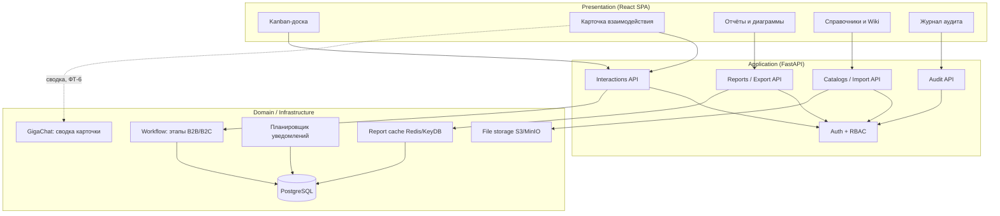

# Функциональная архитектура

Схема отражает пользовательский путь КАМ (5 шагов: авторизация, просмотр,
фильтрация, актуализация статуса, отчёт) и сервисы бэкенда, которые его
обслуживают. Диаграмма в формате Mermaid отображается в GitHub/GitLab;
при необходимости экспортируется в PNG/PDF для презентации.

Та же модель в ArchiMate 3 — [`functional.archimate`](/docs/architecture/functional.archimate)
(открывается в [Archi](https://www.archimatetool.com/)), готовая
[PDF-версия](/docs/architecture/functional.pdf). Mermaid-исходник для рендера —
[`functional.mmd`](/docs/architecture/functional.mmd).

## Пользовательский путь и сервисы в Archi

## Операционный цикл: импорт → доска → карточка → отчёт

## Операции и обслуживающие сервисы

| Этап цикла | Экран | Backend-сервис | Ключевые сущности |
|---|---|---|---|
| 1. Импорт данных | `DirectoryPage` | `services/excel_import.py`, `services/import_report.py` | `University`, `ITProduct`, `Interaction` |
| 2. Доска | `BoardPage` | `api/interactions.py` (list, board) | `Interaction`, `WorkflowStageRef` |
| 3. Карточка | `InteractionDrawer` | `api/interactions.py`, `api/files.py` | `Action`, `Comment`, `FileObject` |
| 4. Смена этапа | доска / карточка | `api/interactions.py` (stage update) | `Interaction.stage_id` |
| 5. Отчёты и экспорт | `ReportPage`, `AuditLogPage` | `api/reports.py`, `api/audit.py`, `services/excel_export.py` | `ActionLog`, агрегаты |

## Функциональные блоки

Ключевая бизнес-логика — единый workflow без версий: изменение этапа
применяется мгновенно ко всем активным заявкам, а удаление этапа переносит
задачи на соседний, чтобы работа не останавливалась.

GigaChat вызывается только по запросу пользователя из карточки и не
участвует в основном сценарии: без ключа вкладка «Сводка» сообщает, что
сервис не настроен. Подробности — `docs/AI.md`.
